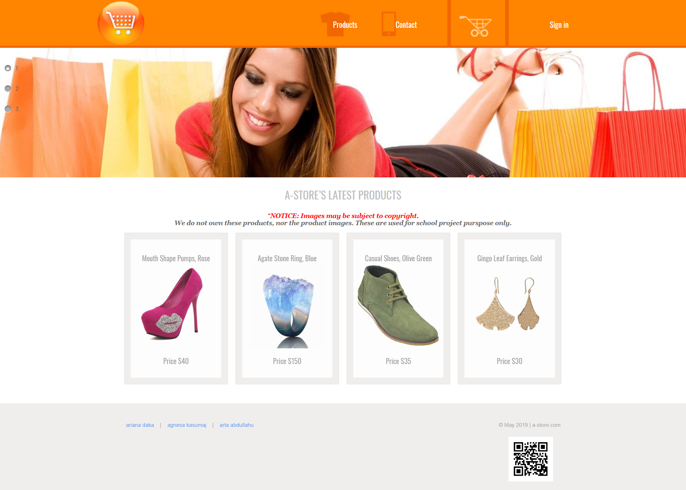
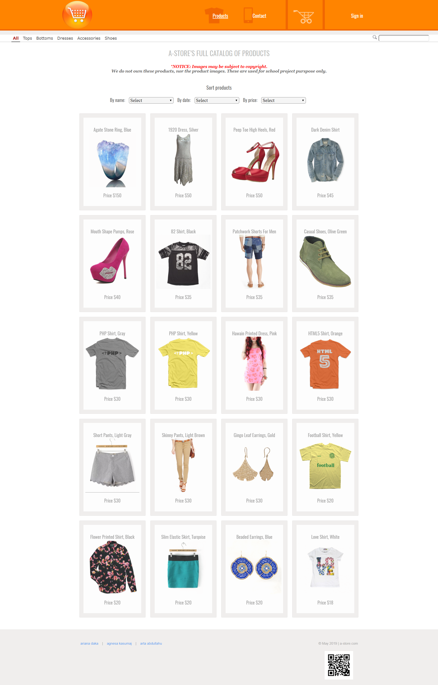
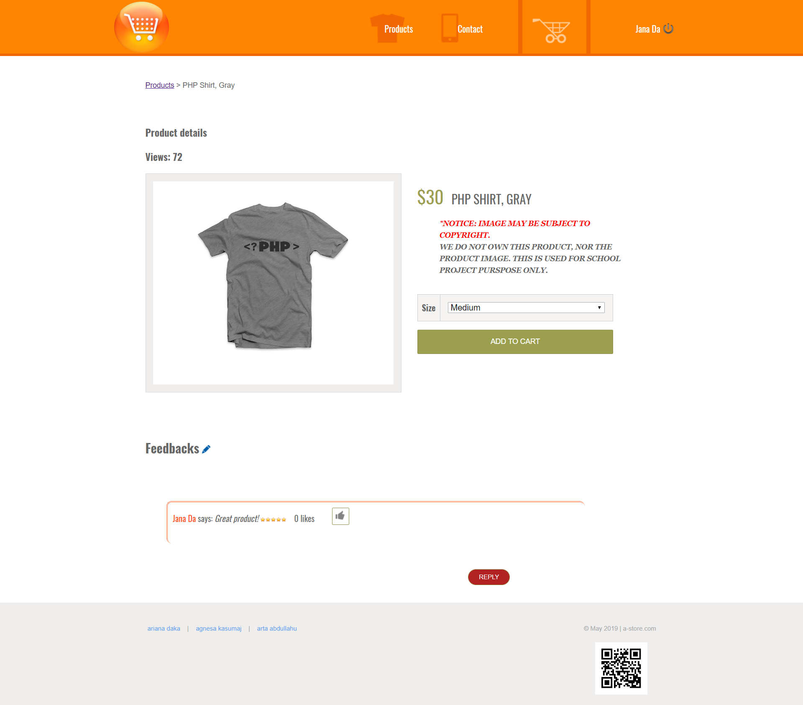
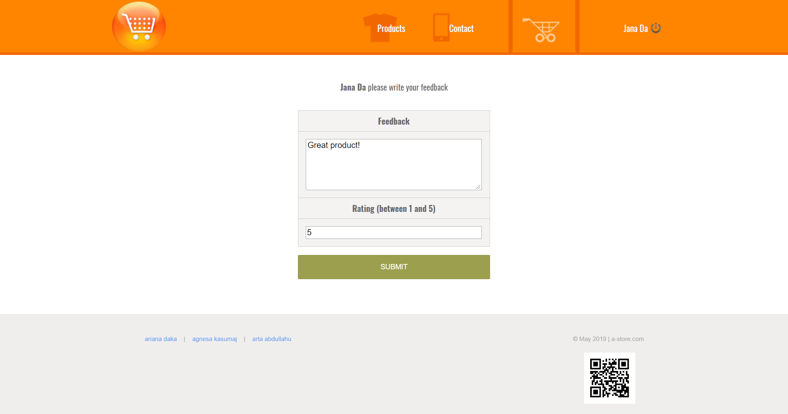
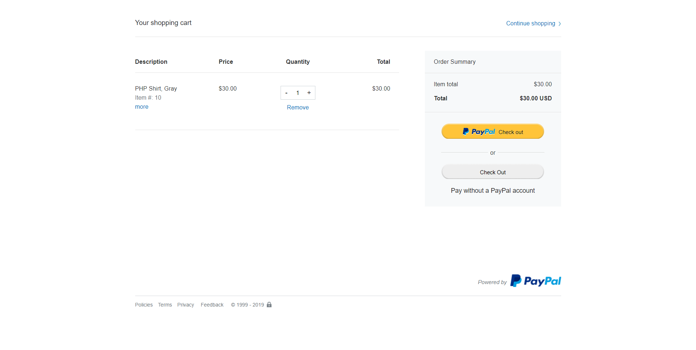

# Online-shop (a-store)
This project was an obligatory project during my studies, where I chose to develop an online shop website called a-store. Some front end features are integrated from a PHP course at TeamTreeHouse. But the back end is entirely done manually. This website includes profile creation, with two different privileges: admin and user; the admin privilege having permissions to add, update and delete products and users. Once a user adds a product to the cart, it redirects to the paypal shopping cart; which in turn asks to log in to paypal in order to pay. But the payment should not be carried through as these are not actual products owned by us! 

Sample screenshots:

